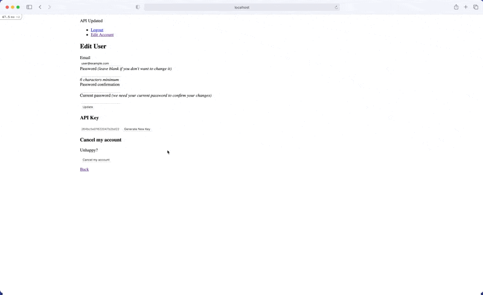
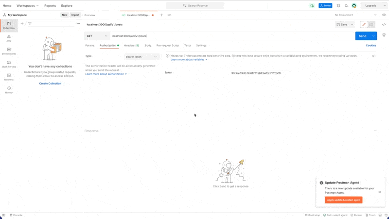
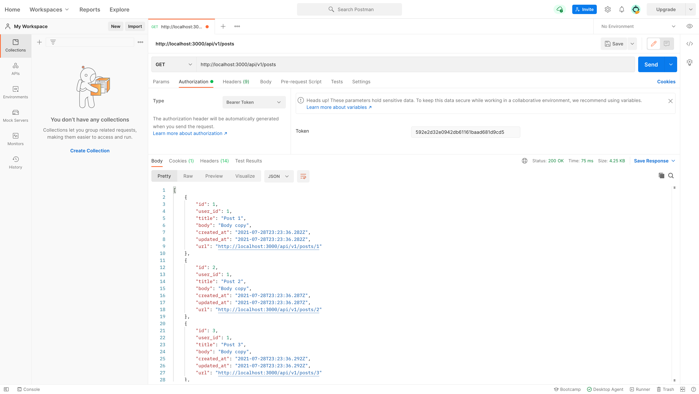
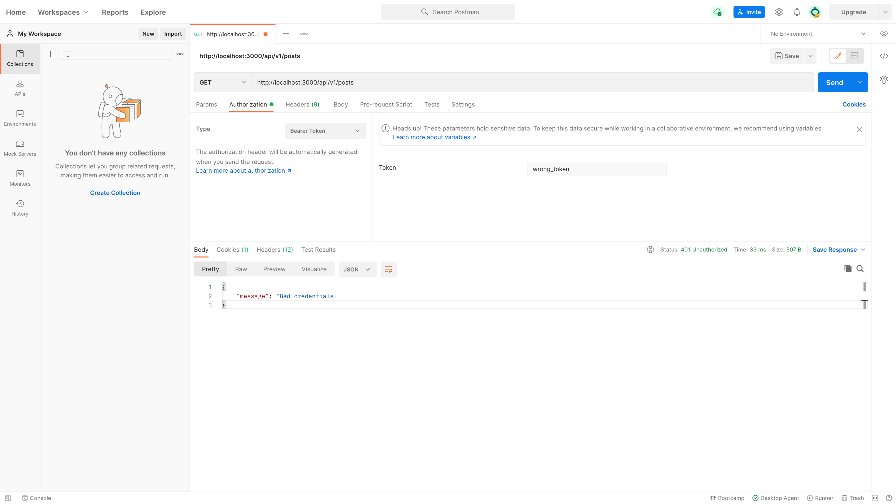
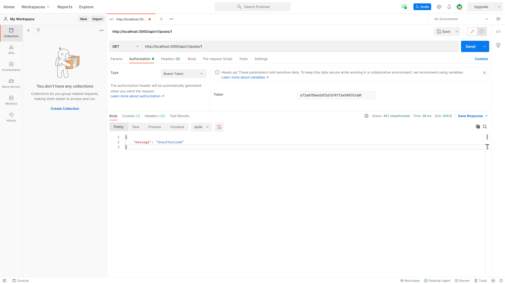
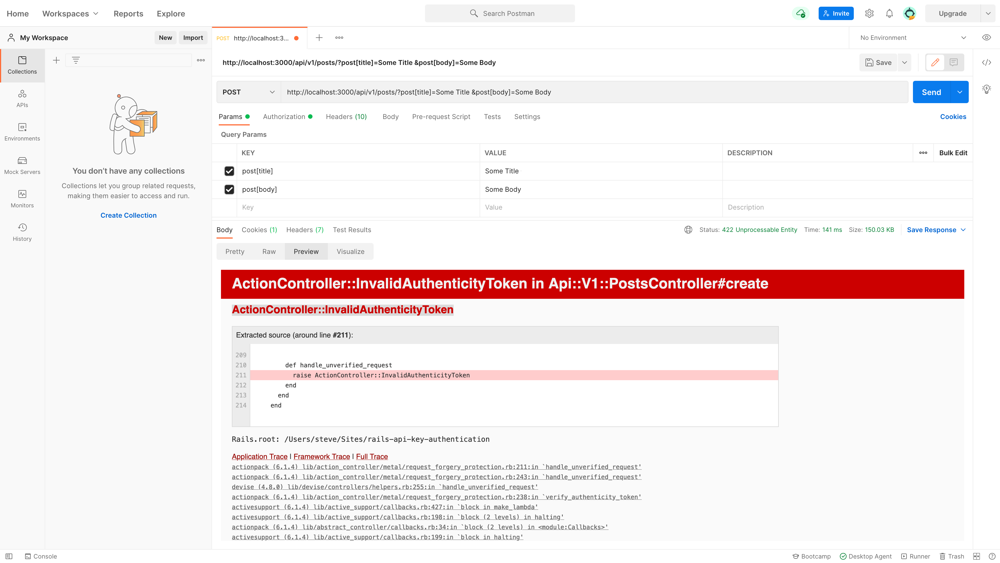
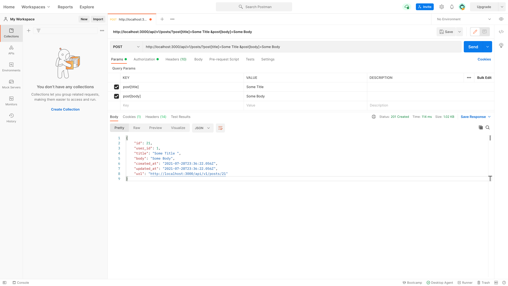

In this tutorial we'll build a full featured API in Rails with authentication and the ability to monitor requests.


_A form allowing users to view and rotate their private API key_


_A demo of the API_

## Step 1: Add Encrypted Private API Key Column to Users Table

1. Install [lockbox](https://github.com/ankane/lockbox) and [blind_index](https://github.com/ankane/blind_index).

```
bundle add lockbox
bundle add blind_index
```

2. Configure Lockbox for test, development and production environments. You'll want to run the following code for each environment.

```
rails c 
Lockbox.generate_key
=> "123abc"
rails credentials:edit --environment=test
```

```yaml
lockbox:
  master_key: "123abc"
```

3. Create migration.

```
rails g migration add_private_api_key_ciphertext_to_users private_api_key_ciphertext:text
```

```ruby
# db/migrate/xxx_add_private_api_key_ciphertext_to_users.rb
class AddPrivateApiKeyToUsers < ActiveRecord::Migration[6.1]
  def change
    # encrypted data
    add_column :users, :private_api_key_ciphertext, :text
    
    # blind index
    add_column :users, :private_api_key_bidx, :string
    add_index :users, :private_api_key_bidx, unique: true
  end
end
```

```
rails db:migrate
```

4. Update User model.

```ruby
# app/models/user.rb
class User < ApplicationRecord
  encrypts :private_api_key
  blind_index :private_api_key
end
```

5. Set private api key via a callback.

```ruby
# app/models/user.rb
class User < ApplicationRecord
  encrypts :private_api_key
  blind_index :private_api_key

  before_create :set_private_api_key

  validates :private_api_key, uniqueness: true, allow_blank: true

  private

    def set_private_api_key
      self.private_api_key = SecureRandom.hex if self.private_api_key.nil?
    end
  end
end
```

> **What's Going On Here?**
>
> - We use Lockbox as a means to encrypt the private API key because the key is essentially as sensitive as a username and password. If the database were every compromised, the keys would not be exposed. This gem also allows us to reference the column as `private_api_key` and not `private_api_key_ciphertext`
> - We use Blink Index as a means to query against the key, as well as ensure its value is unique. We need Blink Index because the column is encrypted.
> - We add a validation ensuring the key is unique. This is because the key will be used to identify a user.
> - We use [SecureRandom](https://ruby-doc.org/stdlib-3.0.2/libdoc/securerandom/rdoc/SecureRandom.html) to generate a unique value for the key. This is necessary to make it difficult for someone to guess another user's key.

## Step 2: Allow User to View and Rotate Private API Key

1. Create an endpoint for creating a new key.

```
rails g controller user/private_api_keys
```

```ruby
# app/controllers/user/private_api_keys_controller.rb
class User::PrivateApiKeysController < ApplicationController
  before_action :authenticate_user!

  def update
    if current_user.update(private_api_key: SecureRandom.hex)
      redirect_to edit_user_registration_path, notice: "API Updated"
    else
      redirect_to edit_user_registration_path, alert: "There was an error: #{current_user.errors.full_messages.to_sentence}"
    end
  end
end
```

2. Update routes.

```ruby
# config/routes.rb
Rails.application.routes.draw do
  namespace :user do
    resource :private_api_keys, only: :update
  end
end
```

3. Update views.

```
rails g devise:views
```

```html+erb
# app/views/devise/registrations/edit.html.erb
<%= form_for(resource, as: resource_name, url: registration_path(resource_name), html: { method: :put }) do |f| %>
...
<% end %>
...
<h3>API Key</h3>
<%= form_with model: current_user, url: user_private_api_keys_path do |f| %>
  <%= f.text_field :private_api_key, disabled: true %>
  <%= f.submit "Generate New Key" %>
<% end %>
...
```


> **What's Going On Here?**
>
> - We create a [namespaced](https://guides.rubyonrails.org/routing.html#controller-namespaces-and-routing) endpoint allowing a user to update their API key. We don't need to namespace the route, but it helps keep things organized.
> We add a new form to the view generated by Devise. This form simply hits the endpoint and generates a new API key.
>   - Note that we set the input to be disabled to ensure a user can't set their own key. We want this to happen server side. 

## Step 3: Create Post Model

1. Create and run migration.

```
rails g model Post user:references title:string body:text
rails db:migrate
```

2. Add validations.

```ruby
# app/models/post.rb
class Post < ApplicationRecord
  belongs_to :user

  validates :title, :body, presence: true
end
```

3. Associate with User.

```ruby
# app/models/user.rb
class User < ApplicationRecord
  ...
  has_many :posts, dependent: :destroy
  ...
end
```

4. Seed data.

```ruby
# db/seeds.rb
User.create(email: "user@example.com", password: "password")
10.times do |i|
  User.first.posts.create(title: "Post #{i+1}", body: "Body copy")    
end


User.create(email: "another_user@example.com", password: "password")
```

```
rails db:seed
```

## Step 4: Create API Endpoints

1. Generate namespaced controllers

```
rails g controller api/v1/posts
```

2. Add routes.

```ruby
# config/routes.rb
Rails.application.routes.draw do
  namespace :api do
    namespace :v1 do
      defaults format: :json do
        resources :posts, only: [:index, :create, :show, :update, :destroy]
      end
    end
  end
end
```

3. Create base controller.

```
touch app/controllers/api/v1/base_controller.rb
```

```ruby
# app/controllers/api/v1/base_controller.rb
class Api::V1::BaseController < ApplicationController
end
```

```ruby
# app/controllers/api/v1/posts_controller.rb
class Api::V1::PostsController < Api::V1::BaseController
end
```

> **What's Going On Here?**
>
> - We create a [namespaced](https://guides.rubyonrails.org/routing.html#controller-namespaces-and-routing) endpoint to encapsulate and version our API. This is best practice since we'll want to make a new version of our API each time we make changes to it while still maintaining older versions.
> - We set the [default format](https://guides.rubyonrails.org/routing.html#defining-defaults) to respond with JSON. This means all responses from the API will be sent as JSON.  
> - We create a base controller that will be inherited by the API. This will make it easy to add shared logic in the API without affecting the web interface.
>   - Note that our `Api::V1::PostsController` now inherits from `Api::V1::BaseController` and not `ApplicationController`.

## Step 5: Authenticate Requests

1. Authenticate all requests to the API. 

```ruby
# app/controllers/api/v1/base_controller.rb
class Api::V1::BaseController < ApplicationController
  before_action :authenticate

  private

    def authenticate
      authenticate_user_with_token || handle_bad_authentication
    end

    def authenticate_user_with_token
      authenticate_with_http_token do |token, options|
        @user ||= User.find_by(private_api_key: token)
      end
    end

    def handle_bad_authentication
      render json: { message: "Bad credentials" }, status: :unauthorized
    end

end
```

> **What's Going On Here?**
>
> - We use the [authenticate_user_with_token](https://github.com/rails/rails/blob/83217025a171593547d1268651b446d3533e2019/actionpack/lib/action_controller/metal/http_authentication.rb#L352) method that ships with Rails to authenticate all requests to our API with a user's private API key that will be sent through an [Authorization HTTP header](https://developer.mozilla.org/en-US/docs/Web/HTTP/Headers/Authorization). We could pass the private API key via a [querystring](https://en.wikipedia.org/wiki/Query_string), but we would not be able to use `authenticate_user_with_token` method to find the user which is more secure.
> - We handle bad requests by responding with a JSON payload containing a simple message and a status of 401. It's our responsibility to respond with the correct [HTTP Status Code](https://developer.mozilla.org/en-US/docs/Web/HTTP/Status).

## Step 6: Handle Missing Records

1. Handle missing records.

```ruby
# app/controllers/api/v1/base_controller.rb
class Api::V1::BaseController < ApplicationController
  rescue_from ActiveRecord::RecordNotFound, with: :handle_not_found

  before_action :authenticate

  private

    def authenticate
      authenticate_user_with_token || handle_bad_authentication
    end

    def authenticate_user_with_token
      authenticate_with_http_token do |token, options|
        @user ||= User.find_by(private_api_key: token)
      end
    end

    def handle_bad_authentication
      render json: { message: "Bad credentials" }, status: :unauthorized
    end

    def handle_not_found
      render json: { message: "Record not found" }, status: :not_found
    end

end
```

> **What's Going On Here?**
>
> - We [rescue_from](https://api.rubyonrails.org/classes/ActiveSupport/Rescuable/ClassMethods.html#method-i-rescue_from) any missing record with a custom JSON response. You can think of this as a custom 404 page, but for an API. We make sure to respond with the correct [HTTP Status Code](https://developer.mozilla.org/en-US/docs/Web/HTTP/Status).

## Step 7: Create Response Views

1. Generate response partials with [Jbuilder](https://guides.rubyonrails.org/action_view_overview.html#jbuilder).

```
rails g jbuilder api/v1/posts user:references title:string body:text --model-name=Post
```

2. Update paths.

```ruby
# app/views/api/v1/posts/index.json.jbuilder
json.array! @posts, partial: "api/v1/posts/post", as: :post
```

```ruby
# app/views/api/v1/posts/index.json.jbuilder
json.partial! "api/v1/posts/post", post: @post
```

```ruby
# app/views/api/v1/posts/_post.json.jbuilder
json.url api_v1_post_url(post, format: :json)
```

> **What's Going On Here?**
>
> - We use [Jbuilder](https://guides.rubyonrails.org/action_view_overview.html#jbuilder) to create the views our API will respond with. Instead of creating `.html.erb` files, we're simply creating JSON files. We could render the data directly in the `Api::V1::PostsController`, but this keeps our controller lean by using Rails conventions.

## Step 8: Create Endpoints

1. 

```ruby
# app/controllers/api/v1/posts_controller.rb
class Api::V1::PostsController < Api::V1::BaseController
  before_action :set_post, only: [:show, :update, :destroy] 

  def index
    @posts = @user.posts
  end

  def show
  end

  def create
    @post = @user.posts.build(post_params)
    if @post.save
      render :show, status: :created
    else
      render json: { message: @post.errors.full_messages }, status: :unprocessable_entity
    end
  end

  def update
    if @post.update(post_params)
      render :show, status: :ok
    else
      render json: { message: @post.errors.full_messages }, status: :unprocessable_entity
    end
  end

  def destroy
    @post.destroy
    render :show, status: :ok
  end 
  
  private

    def set_post
      @post = Post.find(params[:id])
    end

    def post_params
      params.require(:post).permit(:title, :body)
    end
end
```

> **What's Going On Here?**
>
> - We create a traditional [controller](https://guides.rubyonrails.org/action_controller_overview.html) with endpoints to list posts, get a post, update a post, create a post and delete a post.
> - Since this controller inherits from `Api::V1::BaseController` all requests will need to be authenticated.
> - We make sure to always respond with JSON either through our Jbuilder views, or directly in the controller.
> - We pass any error message to a `message` key in the JSON response. We don't have to call this key `message`, nor do we have to respond with a message at all, but we want to make out API helpful.
> - We make sure to always respond with the correct [HTTP Status Code](https://developer.mozilla.org/en-US/docs/Web/HTTP/Status).

If you use an API client like [Postman](https://www.postman.com/) you can test the API.


_A successful request to the index action._


_A non authenticated request to the index action._

## Step 9: Authorize Requests.

1. Authorize requests

```ruby
# app/controllers/api/v1/posts_controller.rb
class Api::V1::PostsController < Api::V1::BaseController
  ...
  before_action :authorize_post, only: [:show, :update, :destroy]
  ...
  private
    ...
    def authorize_post
      render json: { message: "Unauthorized" }, status: :unauthorized unless @user == @post.user
    end
    ...
end
```


_A unauthorized request to the show action._

## Step 10: Handle Invalid Authenticity Token


_Invalid Authenticity Token is raised when trying to create a post_

1. Update Controller.

```ruby
# app/controllers/api/v1/base_controller.rb
class Api::V1::BaseController < ApplicationController
  protect_from_forgery with: :null_session
  ...
end
```

> **What's Going On Here?**
> 
> - By default, Rails protects any request other than a GET request from Cross-Site Request Forgery (CSRF) attacks by including a token in the rendered HTML for your application. However since we're making a request from outside of the application, Rails will raise a `ActionController::InvalidAuthenticityToken` error. 
> - We add a call to [protect_from_forgery with: :null_session](https://api.rubyonrails.org/classes/ActionController/RequestForgeryProtection.html) to allow for unverified requests to hit our API. 


_A successful POST request._

## Step 11: Log API Requests

1. Create Request Model.

```
rails g model Request user:references requestable_type:string method:integer
```

```ruby
# db/migrate/xxx_create_requests.rb
class CreateRequests < ActiveRecord::Migration[6.1]
  def change
    create_table :requests do |t|
      t.references :user, null: false, foreign_key: true
      t.string :requestable_type, null: false
      t.integer :method, null: false

      t.timestamps
    end
  end
end
```

2. Associate with User.

```ruby
# app/models/user.rb
class User < ApplicationRecord
  ...
  has_many :requests, dependent: :destroy
  ...
end
```

3. Validate Model.

```ruby
# app/models/request.rb
class Request < ApplicationRecord
  belongs_to :user

  # ArgumentError: You tried to define an enum named "method" on the model "Request",
  # but this will generate a class method "delete", which is already defined by Active Record.
  enum method: [:get, :post, :put, :patch, :delete], _suffix: true

  validates :method, :requestable_type, :user, presence: true
  validates :requestable_type, inclusion: { in: %w(Post) }
end
```

4. Update Controller to Log API requests.

```ruby
# app/controllers/api/v1/posts_controller.rb
class Api::V1::PostsController < Api::V1::BaseController
  ...

  def index
    ...
    @user.requests.create(method: :get, requestable_type: "Post")
  end

  def show
    @user.requests.create(method: :get, requestable_type: "Post")
  end

  def create
    ...
    @user.requests.create(method: :post, requestable_type: "Post")
  end

  def update
    ...
    @user.requests.create(method: :put, requestable_type: "Post")
  end

  def destroy
    ...
    @user.requests.create(method: :delete, requestable_type: "Post")
  end 
  ...
end
```

> **What's Going On Here?**
> 
> - We make a model to store all requests made by the User. To make this as flexible as possible we add
an [enum](https://edgeapi.rubyonrails.org/classes/ActiveRecord/Enum.html) column to store the request method and a requestable_type column to store the class name of the record in the original API request. This will allow us to see exactly what what type of request was made and on what record. This can be helpful if we need to enforce different usage limits for any combination of request method and record type.  
>   - Note that we add set `_suffix: true` on the enum value. This is because one of the enum values we're setting is `delete`, which is a reserved method name.
>   - We create a validation to limit the requestable_type column to only "Post". This will ensure we keep our records consistently formatted.   
>   - Note that we set a database constraint on the method and requestable_type columns to prevent null values.
> - We create a new `Request` request for each action in the `Api::V1::PostsController`. We make sure to pass the correct HTTP request to the `method`.

```
User.first.requests.count
User.first.requests.where(method: :get).count
User.first.requests.where(method: :get, requestable_type: "Post", created_at: 1.month.ago.beginning_of_day..Time.now.end_of_day).count
```